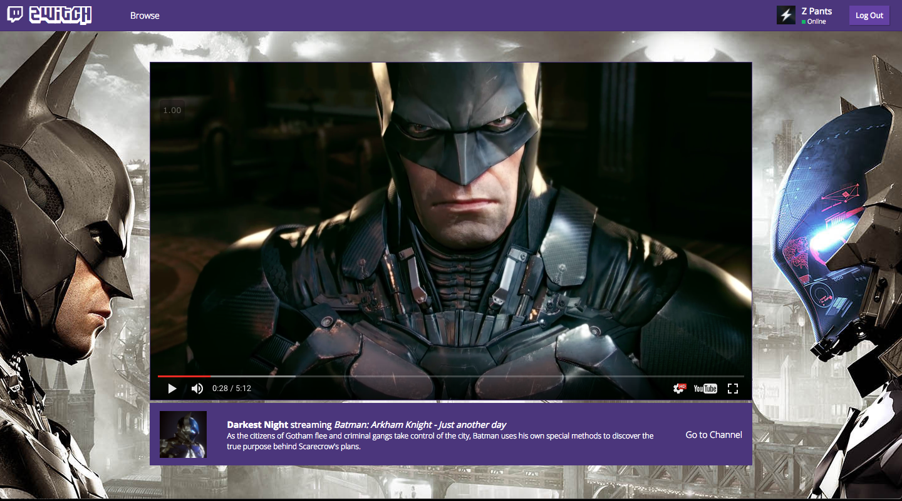
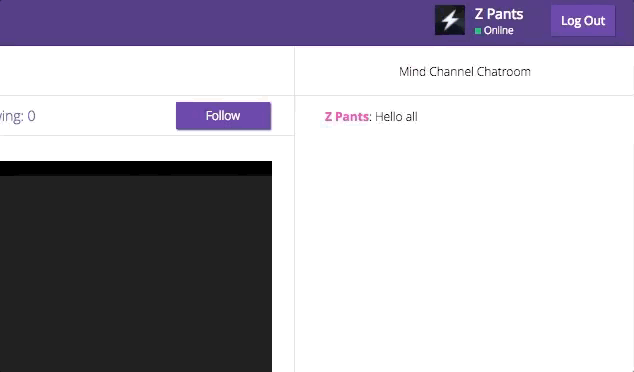

[Check out the Live APP!](zwitch.tv)

# Zwitch.tv

<!--  -->

<p align="center">
  
</p>

A full-stack web application inspired by Twitch, a popular live video platform streaming, Zwitch serves as a social platform where you can stream notable video game oriented videos while interacting with other viewers in realtime.

Built using React/Redux framework for the frontend and Rails 5 for the backend, Zwitch utilizes industry standard practices as well as clever problem solving in its implementation.

###### Note: The goal of this app is to create a platform that would support live streaming. Actual live streaming tech is not implemented... _yet_.

## Notable Features

### Live Chat

While I initially planned only for basic refresh based chats, with a bit of help from Rails Action Cable documentation and guidance from a fellow engineer, I seamlessly integrated WebSockets into my app and implemented live chat. Since Rails Action Cable is full-stack offering that provides both a client-side JavaScript framework and a server-side Ruby framework, it allows using standard rails and react styles and form to implement real time chat.

<!--  -->
<p align="center">
  
</p>

Rails Action Cable essentially works by creating cable channels that different consumers(instances of user) can subscribe to. Each channel can then have zero or more broadcastings where every consumer subscribed to the channel receives the updated transmissions.

For example in the `ChatMessagesController`, in the non-ActionCable rendition of chat the created `ChatMessage` would be sent to the frontend as a JSON. it is now the `ActionCable` that directs the relevant message attributes to all of its subscribers.

```ruby
# app/controllers/api/chat_messages_controller.rb

class Api::ChatMessagesController < ApplicationController

  before_action :require_logged_in

  def create
    @chat_message = ChatMessage.new(chat_message_params)

    if @chat_message.save!

      ActionCable.server.broadcast 'messages',
        id: @chat_message.id,
        body: @chat_message.body,
        username: @chat_message.user.username,
        channel_id: @chat_message.chatroom.channel.id

      # render "api/chat_messages/show"

```

On the frontend, the user now automatically subscribes to the chatroom with the same id as the channel as soon as the component loads and unsubscribes when they leave the page.

```javaScript
// frontend/components/chat/chat.jsx

componentDidMount() {
  this.props.requestChatroom(this.channelId).then(() => {
    this.display.scrollTop = this.display.scrollHeight;

    this.subscription = App.cable.subscriptions.create(
    {
      channel: 'MessagesChannel',
      id: this.props.match.params.channelId
    }, {
      received: data => {
        this.props.receiveChatMessage(data.message);
        this.display.scrollTop = this.display.scrollHeight;
      }
    });
  });

}

componentWillUnmount() {
  App.cable.subscriptions.remove(this.subscription);
}
```

###### `this.display.scrollTop = this.display.scrollHeight` ensures that the chat window is scrolled all the way up when the user visits the page AND when a new chat message is received.

### Instant Image Update

Another advantage of using react's inherent re-renders on setting state is providing immediate feedback on user input.

<!--  -->
<p align="center">
  
</p>

So in the channel customize form if a user enters a valid YouTube or Image link, the onChange event on the input handlers fires a re-render every time the field is edited, instantly confirming that the right image or video was attached.

```javaScript
// frontend/components/channels/channel_form.jsx

update(field) {
  return event => this.setState({
    [field]: event.currentTarget.value
  });
}
```

### Super Cool Hidden Feature

React router by default does not scroll up the window when routing to a different _page_, even though this feature has been requested for a [while](https://github.com/ReactTraining/react-router/issues/2019) [now](https://stackoverflow.com/questions/36904185/react-router-scroll-to-top-on-every-transition/36906825).

The most common solution, using the onUpdate property of the `<Route>` tags,...

`<Router onUpdate={() => window.scrollTo(0, 0)} /> `

...would not work.

So to get around that, I used a dummy `<Route>` whose entire purpose was to scroll up on visiting different _pages_.

Like so,

```javaScript
const App = () => (
  <section className="zwitch">
    <Route component={ScrollToTop} />

    //Rest of routed containers/components
    ...

  </section>
);

// Gets called on routing to new pages.
const ScrollToTop = () => {
  window.scrollTo(0, 0);
  return null;
};

export default App;
```
While not completely obvious or even essential currently, it will certainly allow for smoother transition between pages when the channels gets expanded.

## Future Plans

Besides the already present features, there are quite a few improvements and optimizations that I plan to implement.

- [ ] Synced videos between users (Or atleast being able to innately share links to specific moments in the video)
- [ ] Search channels
- [ ] Get notifications when followed channel starts streaming
- [ ] Allow browsing while watching stream (video in smaller window)
